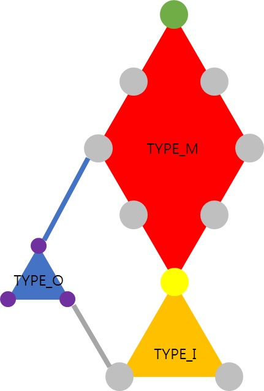

기존의 `select_negative_attr` 함수는 자신을 포함하는 상위지식의 속성을 부정명제로 가져오는 문제점이 있었다. 아래의 개선된 알고리즘은 확실하게 긍정인 명제들을 제외한다.



```pseudocode
// TYPE_I: inter info. 소재가 되는 지식(material)의 하위지식. 소재에 대하여 참을 만족하기 때문에 골라선 안된다.
// TYPE_M: medium info. 출제범위 최상단으로부터 소재까지 도달할 수 있는 모든 경로 상의 지식으로, 소재에 대하여 참을 만족하기 때문에 골라선 안된다. 어떤 지식의 자식 중 하나라도 TYPE_M이 존재하면 자신도 TYPE_M이다.
// TYPE_O: outer info. TYPE_I도 TYPE_M도 아닌 것들.

// 지식 root로부터 도달할 수 있는 모든 하위지식을 전부 제외한다
function discard_subinfos(Info root, Info{} check):
	check[root.jsid] := TYPE_I
	for child in root.childs:
		// discard_subinfos가 실행되기 전에 TYPE_O로 간주된
		// 하위지식이 존재할 수 있으므로, 방문한 적이 있더라도 확인해야 한다
		// 여담으로 TYPE_M인 경우는 존재할 수가 없다
		if child is not visited or check[child.jsid] is TYPE_O:
			discard_subinfos(child, check)

// 지식 upperbound로부터 도달할 수 있는 하위지식을 가져오되
// material 자기자신을 포함하여 material에 도달할 수 있는 모든 중간지식도 제외된다
// upperbound에서 material로 도달할 수 있으면 false를
// 그렇지 않으면 true를 반환한다
function traverse_down(Info root, Info material, Info{} check):
	if root is material:
		discard_subinfos(material)
		return TYPE_M
	else:
		Let rtype := TYPE_O
		for child in root.childs:
			Let ctype := NULL
			if child is not visited:
				ctype := traverse_down(child, material, check)
			else:
				ctype := check[child.jsid]
			if ctype is TYPE_M:
				rtype := TYPE_M
		check[root.jsid] := rtype
		return rtype
		
function select_negative_attr(Info root, Info material):
	Let out := []
	Let check := {}
	traverse_down(root, material, check)
	for (key, value) in check:
		if check is TYPE_O:
			out += get Info having its jsid as key
	return select random attribute(s) from random info from out
```

본래 위 함수를 하나로 통합할 수도 있으나, 함수 인자가 불필요하게 늘어나고 논리적으로 너무 난해해지기 때문에 고의적으로 분리하였다.
